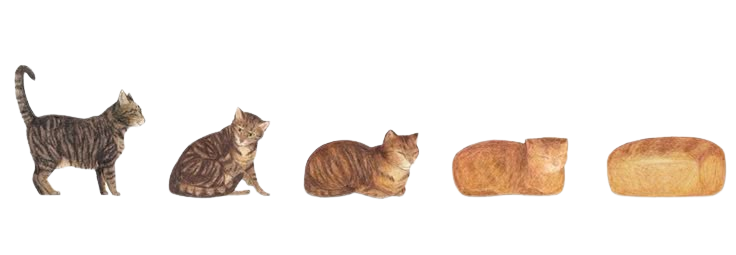

  

  
  
  

---

## Jussi

  <code>Jr. Software Dev (2nd-Year)</code>
  <code>bday: 07/29</code>
  <code>Estonian</code>

  <i>
    I keep breaking my codes, help.
  </i>

 

---

## About me!
### **Hi, I'm Jussi :D**

**_~ Aspiring Junior Software Developer ~ I mostly enjoy Graphic Design ~_**

 

---

## **Connect**

  

---

   <h2>Languages I've used in my projects:</h2>
  
  
  
  
  

---

## 📊 GitHub Activity

  

  

  

---

